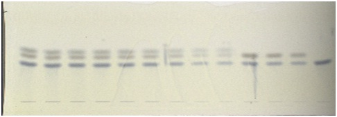
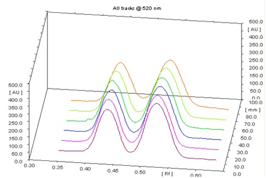
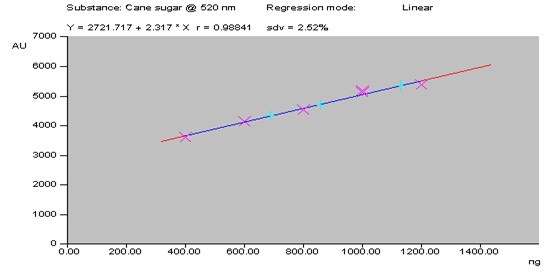
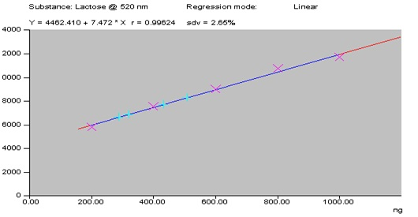

### Procedure

- A stock solution (0.1 mg/ml) of standard cane sugar and lactose was prepared in water: methanol (1:9) and sonicated for 10 minutes over an ultrasonic bath.

- The solution was filtered through Whatman No. 42 filter paper and filtrate was used as sample solution.

- A 20cm × 10cm HPTLC plate coated with silica gel 60 F 254 was used for analysis.

- The samples were applied at 10 mm from the base of HPTLC plate by means of a Camag (Switzerland) Linomat V sample applicator using a syringe (100µL, Hamilton, Bonaduz, Switzerland).

- A linear calibration curve was obtained on applying the increasing concentrations of standard cane sugar and lactose in the range (200-1000 ng).

- HPTLC analysis was performed on a computerized densitometer scanner 3, controlled by WinCATS planar chromatography manager version 1.4.4. (CAMAG, Switzerland).

- Plate was developed to a distance of 80 mm, in a Camag twin-trough chamber with mobile phase [n-Butanol: Acetic acid: Water:: 2:1:1 (v/v)].

- Plates were derivatized using aniline diphenylamine phosphoric acid.

- Plates were evaluated by densitometry at 520 nm with a Camag Scanner 3 for quantification.

### Observation

The chromatographic profile of the sample was simple, showing good separation of cane sugar and lactose. Peak of cane sugar and lactose were identified using the solvent system [n-Butanol: Acetic acid: Water:: 2:1:1 (v/v)]. Cane sugar and lactose are not UV active, so the plates were derivatized using aniline diphenylamine phosphoric acid (Fig. 1). The Rf value of cane sugar and lactose was found to be 0.52 and 0.43 ± 0.03 respectively and there was no overlap with any other analyses of the sample at 520 nm (Fig.2).

   
  <strong>Fig. 1: Derivatized image of HPTLC plate</strong>
     
   
  <strong>Fig. 2: 3D-display of cane sugars and lactose</strong>
    

The linearity of the proposed method was confirmed in the range of 200-1000 ng of standard cane sugar and lactose. A linear regression of the data points for standard cane sugars is resulted in a calibration curve with the equation Y = 2721.717 + 2.317 X [regression coefficient (r2) = 0.98841, standard deviation (S.D.) = 2.65%] (Fig. 3). Similarly the linear regression of the data points for standard lactose is resulted in a calibration curve with the equation Y = 4462.410 + 7.472 X [regression coefficient (r2) = 0.99624, standard deviation (S.D.) = 2.52%] (Fig. 4). Cane sugar and lactose contents in market purchased milk samples were calculated and depicted in Table 1.

   
  <strong>Fig. 3: Calibration curve of cane sugar</strong>
     
   
  <strong>Fig. 4: Calibration curve of lactose</strong>
    
  <strong>Table 1: Cane sugars and lactose content in milk</strong>
    

| Milk Samples (%) | Cane sugar (%) | Lactose (%) |
|------------------|----------------|-------------|
| Pure Milk        | 0 (naturally occurring) | 5.0 (naturally occurring) |
| Milk sample 1    | 30.56 ± 0.60   | 17.38 ± 0.72 |
| Milk sample 2    | 27.11 ± 0.54   | 14.44 ± 0.44 |
| Milk sample 3    | 19.98 ± 0.67   | 11.21 ± 0.39 |

The linearity, accuracy in terms of recovery % and precision was considered for the method. Validation of the method at three concentration levels was carried out by the standard recovery formula returned a mean of 91.76%. Precision (repeatability) was determined by running a minimum of four analyses and the coefficient of variability was found to be 3.114 and 2.156 % for cane sugars and lactose respectively. The limit of detection (LOD) and quantification (LOQ) for cane sugar was found to be 3.58 and 10.87 and for lactose it is 1.17 and 3.546 ng respectively.
