## Reagents List

- **Cane sugar standard**  
- **Lactose standard**  
- **n-butanol**  
- **Acetic acid**  
- **Aniline diphenylamine phosphoric acid**

## Theory

India has been called the land of *Annapurna*. Food, milk and waters are not only the elixir of life but they are worshiped as God. In spite of this fact food adulteration is present in our society to a great extent. In India, normally the adulteration in edibles is done either for financial gain or due to carelessness and lack in proper hygienic condition of processing, storing, transportation and marketing. This ultimately results that the consumer is either cheated or often become victim of diseases.

  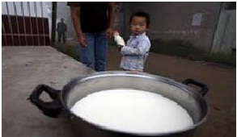

According to Federal Standard of United States of America, milk is a fresh, clear, lacteal secretion obtained by the milking of one or more healthy cows and containing not less than 3.25% of milk fat. Milk is a complete food, readily digested and absorbed.

  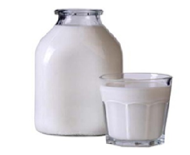

Various constituent of milk, in general, as follows:

| Constituent | Percentage |
|-------------|------------|
| Water       | 87.30%     |
| Fat         | 3.60%      |
| Protein     | 3.90%      |
| Milk sugar  | 4.50%      |
| Ash         | 0.70%      |

#### Adulteration in milk

  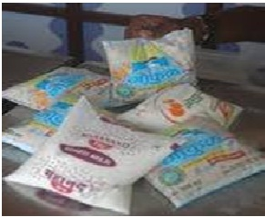
  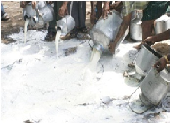

Milk is produced throughout the year. However, milk production is greatly reduced during summer months due to heat stress and scarcity of fodder and provides temptation for its adulteration to increase its bulk. Adulteration is practised either to substitute cheaper ingredients or to impress the buyer to think the product is more valuable or of better quality. Milk is a perishable commodity so during summer months, it is likely to be spoiled during transportation. Therefore, people add chemical preservatives. Use of any additives to milk, which might promote or alter the composition or of detrimental to the health of consumers are termed as adulterant.

### Synthetic Milk

  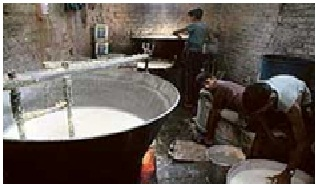
  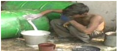

It is the solution of some cheaper vegetable oil/machine oil/cutting oil, soap solution, urea, sodium chloride and sugar. It is almost similar in appearance and taste. It costs about 3 Rs. per litre. About 9 litre of the solution when mixed one litre of water makes 10 litre of synthetic milk. Synthetic milk is more stable than natural.

### Effect of synthetic milk on human system

| Adulterant | Health Effect | Image |
|------------|---------------|-------|
| Urea and caustic soda | Damage to liver and kidney | 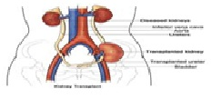 |
| Urea and caustic soda | Lung cancer | 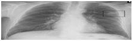 |
| Urea and caustic soda | Children, who are so largely dependent upon milk, do not well tolerate its adulteration. | 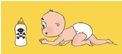 |
| Urea and caustic soda | Respiratory, gall bladder and gastrointestinal system. | 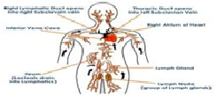 |
| Urea and caustic soda | Injurious for heart patients. | 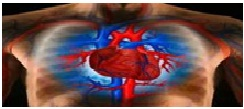 |
| Urea and caustic soda | Tension and blood pressure. | 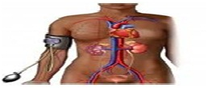 |

### Role of various chemicals in synthetic milk

| Chemical | Role |
|----------|------|
| *Vegetable oil* | To provide oily nature and fat in milk |
| *Soap* | To provide foam touch in milk |
| *Urea* | To provide whiteness in milk |
| *Sugar & Sodium Chloride* | To provide milk taste |

## Qualitative estimation of adulterants in milk

### Presence of sugar

Take 10 ml of milk in a test tube. Add 1 ml of Conc. HCl and mix. Add 0.1 gm of resorcinol and mix thoroughly. Place tube in boiling water for 5 minutes. The appearance of red colour confirms the presence of sugar in milk.

### Presence of Skim milk powder

Take 10 ml of milk and centrifuge. Decant the supernatant. Dissolve the residue in Conc. HNO3 and little water. Add 4 ml liquor ammonia. The appearance of orange colour confirms the presence of skim milk powder.

### Presence of Gelatin solution

Take 10 ml of milk and add equal amount of mercuric nitrate solution. Shake and dilute it with 10 ml H2O. Filter and add equal volume of saturated solution of picric acid. The appearance of white ppt indicates the presence of gelatin.

### Presence of Carbonate in milk

Take 10 ml milk in a test tube. Add 10 ml of alcohol and shake well. Add three-four drops of Rosalic acid mix well. Rose red colour shows the presence of carbonate and brownish colour shows absence of carbonate.

### Presence of Formalin

Take 5 ml of milk sample and 5 ml of concentrated H2SO4 + little of FeCl3 formation of purple ring at the junction, indicates formaldehyde in milk.

## Presence of NaCl

Take 5 ml of milk and add 0.1 ml of 5% of potassium chromate and 2 ml of 0.1% silver nitrate. The appearance of red ppt indicates the presence of sodium chloride in milk. 
